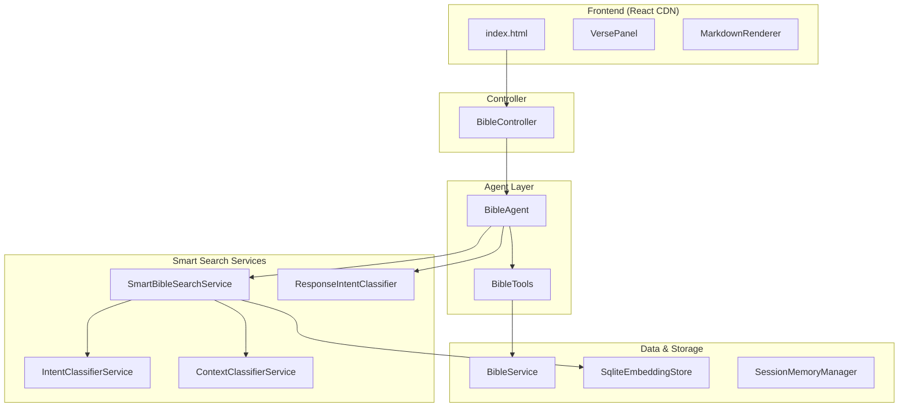
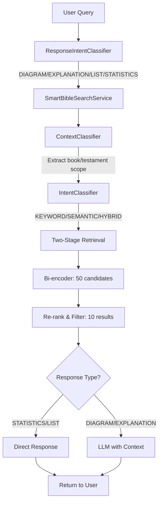

# Bible AI

A conversational Bible study agent supporting both Korean Revised Version (KRV) and American Standard Version (ASV) Bibles. Built with Spring Boot, LangChain4j, and Google Gemini AI.

## Features

### Core Capabilities
- **Natural Language Bible Search**: Search and explore the Bible through natural language
- **Smart RAG System**: Dual intent classification for optimal search and response
- **Verse Lookup**: Get specific verses by book, chapter, and verse number
- **Verse Range**: Get multiple verses in a range (e.g., Genesis 1:1-10)
- **Context-Aware Reading**: Get verses with surrounding context for better understanding
- **Keyword Search**: Find verses containing specific keywords or phrases
- **Chapter Reading**: Read entire chapters at once
- **Keyword Statistics**: Analyze how often words appear across the Bible with filtering options
- **Session Management**: Maintains conversation context across multiple questions
- **Mermaid Diagrams**: Visual representation of genealogy, relationships, and concepts
- **Interactive Verse Links**: Click verse references to preview with context
- **Cursor-like UI**: Split-pane interface with conversation on left, preview on right

### Smart RAG Architecture
- **Search Intent Classification**: Automatically detects KEYWORD, SEMANTIC, or HYBRID search intent
- **Context Classification**: Extracts testament/book scope from queries (e.g., "in the Old Testament prophets")
- **Response Intent Classification**: Determines response format (DIAGRAM, EXPLANATION, LIST, STATISTICS, CONTEXT)
- **Two-Stage Retrieval**: Bi-encoder candidate retrieval → re-ranking and filtering
- **Pre-Retrieved Context**: Verses are fetched before LLM invocation for accuracy

### Advanced Features
- **Multi-language Support**: Korean (KRV) and English (ASV) Bible versions
- **Filtered Statistics**: Search by testament (Old Testament/New Testament) and book type (Prophets/Gospels/Epistles)
- **SQLite Embedding Store**: Fast cold starts with pre-built embedding database
- **GCS Persistence**: Optional cloud storage for embeddings
- **Multi-turn Conversations**: Maintains context across multiple questions within a session
- **Error Recovery**: Automatically clears corrupted sessions to prevent error propagation
- **Smart Memory Management**: Auto-cleanup to prevent Gemini API function calling issues

## Architecture

### Tech Stack
- **Backend**: Spring Boot 3.5.4 with Java 25
- **AI Framework**: LangChain4j 1.2.0
- **LLM**: Google Gemini 2.5 Flash (via `langchain4j-google-ai-gemini`)
- **Bible Data**: 
  - KRV (Korean Revised Version) - 66 books, 31,024 verses
  - ASV (American Standard Version) - 66 books, 31,101 verses
- **RAG**: Smart RAG with dual intent classification
  - Embedding Model: All-MiniLM-L6-v2 quantized (ONNX-based)
  - Storage: SQLite (preferred), GCS, or in-memory
- **Frontend**: Vanilla React 18 via CDN (ES modules), modular CSS/JS

### Key Components



**Agent & Tools:**
- **BibleAgent**: LangChain4j AI service with dual intent classification and pre-retrieval
- **BibleTools**: Tool-calling interface with 10 tools including `advancedBibleSearch`

**Smart Search Services:**
- **SmartBibleSearchService**: Two-stage retrieval with context-aware filtering
- **IntentClassifierService**: Classifies search intent (KEYWORD/SEMANTIC/HYBRID)
- **ContextClassifierService**: Extracts testament/book scope from queries
- **ResponseIntentClassifier**: Determines response format (DIAGRAM/EXPLANATION/LIST/etc.)

**Data & Storage:**
- **BibleService**: Loads and queries Bible data from JSON
- **SqliteEmbeddingStore**: SQLite-backed embedding store for fast cold starts
- **EmbeddingStoreService**: GCS persistence for embeddings
- **SessionMemoryManager**: Session-based chat memory (max 10 messages, auto-cleanup)

**Configuration:**
- **RAGConfig**: Embedding model and store configuration with priority loading (SQLite → GCS → generated)
- **LLMConfig**: Gemini/OpenAI/Llama model configuration

## Setup

1. **Configure Environment Variables**:
   ```bash
   export GEMINI_API_KEY=your-google-api-key
   export GEMINI_MODEL_NAME=gemini-2.5-flash-lite  # Optional, defaults to gemini-2.5-flash-lite
   
   # Embedding store options (for faster startup)
   export EMBEDDING_SQLITE_ENABLED=true  # Use pre-built SQLite database
   export EMBEDDING_SQLITE_PATH=/path/to/bible-embeddings.db
   # Or use GCS
   export EMBEDDING_GCS_ENABLED=true
   export EMBEDDING_GCS_BUCKET=your-bucket
   ```

2. **Build and Run**:
   ```bash
   mvn clean install
   mvn spring-boot:run
   ```

3. **Access UI**:
   Open http://localhost:8080 in your browser

## Usage

### Query Examples

**Verse Lookup:**
- "Show me Genesis 1:1"
- "John 3:16"

**Verse Range:**
- "Genesis 1:1-10"
- "Matthew 5:1-12"

**Context-Aware Reading:**
- "Show me John 3:16 with surrounding verses"
- "Show me verses about love with context"

**Chapter Reading:**
- "Read Matthew chapter 5"
- "Psalm 23 entire chapter"

**Keyword Search:**
- "Find verses about love"
- "Verses about faith"
- "God's grace"

**Context-Scoped Search:**
- "Find verses about love in the New Testament"
- "Where is the centurion mentioned in the Gospels?"
- "사랑에 대한 구절을 신약에서 찾아줘"

**Statistics with Filters:**
- "How many times does the word 'love' appear in the Bible?"
- "How many times does 'love' appear in Old Testament prophets?"
- "How many times does 'faith' appear in New Testament gospels?"

**Topic Exploration with Diagrams:**
- "Explain Jesus' genealogy with a diagram"
- "백부장이 나온 구절을 그림으로 설명해줘"
- "Show me the relationship between the 12 tribes visually"

**Genealogy & Diagrams:**
- "Explain Jesus' genealogy with a diagram"
- "Genealogy from Abraham to David"

## Project Structure

```
src/main/java/io/github/nicechester/bibleai/
├── agent/           # BibleAgent (dual intent classification, pre-retrieval)
├── config/          # Configuration beans:
│   ├── LLMConfig           # Gemini/OpenAI/Llama configuration
│   └── RAGConfig           # Embedding store with priority loading
├── controller/      # REST endpoints:
│   └── BibleController     # Query, search, verse lookup endpoints
├── model/           # Request/Response DTOs:
│   ├── QueryRequest/Response   # Query with optional sessionId
│   ├── SearchIntent           # KEYWORD/SEMANTIC/HYBRID
│   ├── ContextResult          # Testament/book scope
│   ├── SearchResponse         # Smart search results
│   └── VerseResult            # Individual verse result
├── service/         # Core services:
│   ├── SmartBibleSearchService   # Two-stage retrieval
│   ├── IntentClassifierService   # Search intent classification
│   ├── ContextClassifierService  # Book/testament scope extraction
│   ├── ResponseIntentClassifier  # Response format classification
│   ├── SessionMemoryManager      # Session-based chat memory
│   ├── BibleService              # Bible data loading and querying
│   └── EmbeddingStoreService     # GCS persistence
├── store/           # Embedding stores:
│   └── SqliteEmbeddingStore      # SQLite-backed store
└── tool/            # LangChain4j @Tool annotated methods:
    └── BibleTools                # 10 tools for Bible operations

src/main/resources/
├── bible/           # Bible data:
│   ├── bible_krv.json         # Korean Bible (KRV) - 66 books
│   └── bible_asv.json         # English Bible (ASV) - 66 books
└── static/          # Frontend:
    ├── index.html             # Main SPA entry
    ├── css/                   # Modular CSS files
    │   ├── main.css
    │   ├── chat.css
    │   ├── preview.css
    │   ├── verse-panel.css
    │   └── mermaid.css
    ├── js/
    │   ├── app.js             # Main React app
    │   ├── components/        # React components
    │   │   ├── ChatPane.js
    │   │   ├── PreviewPane.js
    │   │   ├── VersePanel.js
    │   │   └── MarkdownRenderer.js
    │   └── utils/             # Utility modules
    │       ├── api.js
    │       ├── bookMappings.js
    │       └── verseParser.js
    └── views/
        └── reader.html        # Chapter reader view
```

## API Endpoints

### POST `/api/bible/query`
Execute natural language queries about the Bible.

**Request:**
```json
{
   "query": "백부장이 나온 구절을 그림으로 설명해줘",
   "sessionId": "session-1702857890-abc123"
}
```

### POST `/api/bible/search`
Smart search with dual intent classification.

**Request:**
```json
{
   "query": "사랑에 대한 구절을 신약에서 찾아줘",
   "maxResults": 10,
   "minScore": 0.3
}
```

**Response:**
```json
{
   "query": "사랑에 대한 구절을 신약에서 찾아줘",
   "results": [...],
   "totalResults": 10,
   "searchMethod": "HYBRID",
   "detectedContextType": "TESTAMENT",
   "detectedContext": "신약성경"
}
```

### GET `/api/bible/{book}/{chapter}`
Get all verses in a chapter.

### GET `/api/bible/{book}/{chapter}/{verse}`
Get a specific verse.

### GET `/api/bible/{book}/{chapter}/{verse}/context?size=N`
Get verse with N surrounding verses.

### GET `/api/bible/config`
Get Bible configuration and version.

## Available Tools

The AI agent has access to 10 tools:

1. **getVerse(bookName, chapter, verse)**: Get a specific verse
2. **getChapter(bookName, chapter)**: Get all verses in a chapter
3. **getVerseRange(bookName, chapter, startVerse, endVerse)**: Get verses in a range
4. **getVerseWithContext(bookName, chapter, verse, contextVerses)**: Get verse with surrounding context
5. **searchVerses(keyword)**: Search for verses containing a keyword
6. **searchByPhrase(phrase)**: Search for verses containing a phrase
7. **getKeywordStatistics(keyword, testament, bookType)**: Get statistics with optional filters
8. **advancedBibleSearch(query, maxResults)**: **NEW** - Smart search with context-aware filtering
   - Automatically classifies search intent (KEYWORD/SEMANTIC/HYBRID)
   - Extracts book/testament scope from query
   - Two-stage retrieval with re-ranking
9. **searchVersesBySemanticSimilarity(query, maxResults)**: Legacy semantic search
10. **getAllBooks()**: List all Bible books

## Configuration

### Application Settings (`application.yml`)

**LLM (Gemini):**
```yaml
langchain4j:
  llm:
    provider: ${LLM_PROVIDER:gemini}
    gemini:
      model-name: ${GEMINI_MODEL_NAME:gemini-2.5-flash-lite}
      api-key: ${GEMINI_API_KEY:}
```

**Embedding Store (Priority: SQLite → GCS → Generated):**
```yaml
bible:
  embedding:
    sqlite:
      enabled: ${EMBEDDING_SQLITE_ENABLED:false}
      path: ${EMBEDDING_SQLITE_PATH:classpath:embeddings/bible-embeddings.db}
    gcs:
      enabled: ${EMBEDDING_GCS_ENABLED:false}
      bucket: ${EMBEDDING_GCS_BUCKET:bible-ai-embeddings}
      blob-name: ${EMBEDDING_GCS_BLOB:embeddings/bible-embeddings.json}
```

**Smart Search Settings:**
```yaml
bible:
  search:
    candidate-count: ${SEARCH_CANDIDATE_COUNT:50}  # Bi-encoder candidates
    result-count: ${SEARCH_RESULT_COUNT:10}        # Final results after re-ranking
    min-score: ${SEARCH_MIN_SCORE:0.3}             # Minimum similarity score
```

## Smart RAG Flow



## Troubleshooting

### Common Issues

**1. Slow Startup (Embedding Generation)**
- **Cause**: No pre-built embedding database
- **Fix**: Set `EMBEDDING_SQLITE_ENABLED=true` with a pre-built `.db` file
- First run will generate embeddings (~30 seconds)

**2. ONNX Runtime Logs**
- **Cause**: Normal behavior - embedding model initialization
- **Action**: No action needed, these logs are expected

**3. Mermaid Diagram Syntax Errors**
- **Cause**: Incorrect Mermaid syntax or character encoding
- **Fix**: System prompt uses `flowchart TD` with quoted Korean text: `A["한글텍스트"]`

**4. Wrong Response Type Classification**
- **Cause**: Query doesn't match response type prototypes
- **Fix**: Include explicit keywords like "그림", "다이어그램", "통계" for better classification

### Performance Notes

- First startup: ~30 seconds (embedding generation) or instant with SQLite
- Smart search: ~20-50ms per query
- Session cleanup: non-blocking (scheduled task every 10 minutes)
- ChatMemory: limited to 10 messages, auto-cleanup at 8 messages
- Both Korean and English Bibles loaded into embedding store (~62,000 verses total)

## Additional Resources

- [Blue Letter Bible - Apps & Tools](https://www.blueletterbible.org/apps-tools.cfm) - Comprehensive Bible study tools and resources

## License

MIT License - see [LICENSE](LICENSE) file for details.

### Bible Text Copyright

| Version | Published | Copyright Status |
|---------|-----------|------------------|
| 개역한글판 (KRV-Hangul) | 1961 | **Public Domain** (expired 2011-12-31) |
| 개역개정판 (KRV-Revised) | 1998 | © 대한성서공회 (until 2068) |
| ASV (American Standard Version) | 1901 | **Public Domain** |

Source: [대한성서공회 저작권안내](https://www.bskorea.or.kr/bbs/content.php?co_id=subpage2_3_4_1)

This project uses:
- **개역개정판** (Korean Revised Version - Revised Edition, 1998) - © 대한성서공회
- **ASV** (American Standard Version) - Public Domain

---

**Author**: Chester Kim  
**Date**: January 29, 2026
