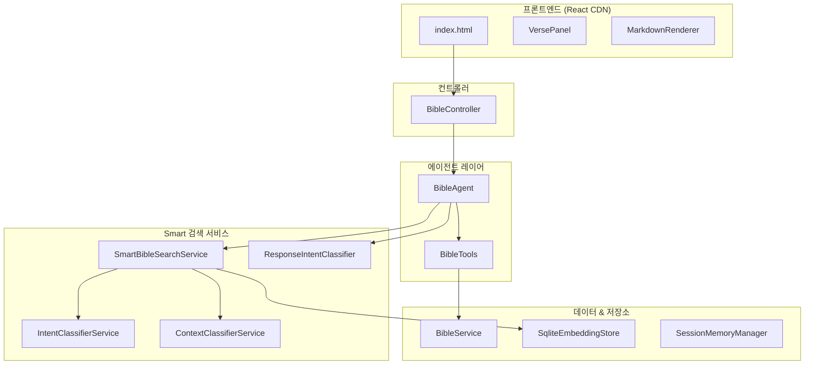
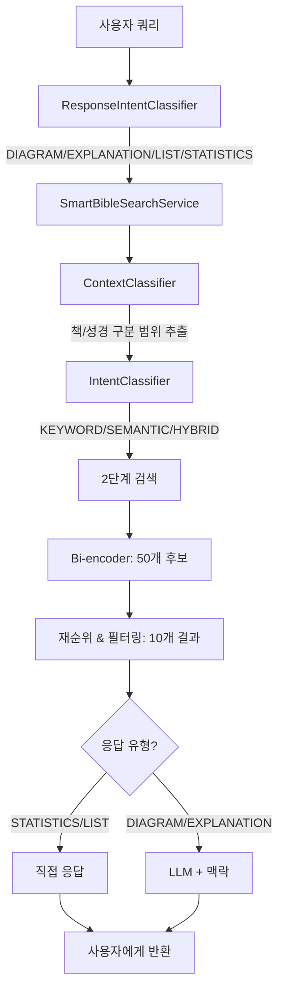

# Bible AI

개역개정(한국어)과 ASV(영어) 성경을 지원하는 대화형 성경 공부 에이전트. Spring Boot, LangChain4j, Google Gemini AI로 구축되었습니다.

## 주요 기능

### 핵심 기능
- **자연어 성경 검색**: 자연어로 성경을 검색하고 탐색
- **Smart RAG 시스템**: 최적의 검색과 응답을 위한 이중 의도 분류
- **구절 조회**: 책, 장, 절 번호로 특정 구절 조회
- **구절 범위 조회**: 여러 구절을 범위로 조회 (예: 창세기 1:1-10)
- **맥락 인식 읽기**: 주변 구절을 포함하여 더 나은 이해를 위한 조회
- **키워드 검색**: 특정 키워드나 구문이 포함된 구절 찾기
- **장 읽기**: 전체 장을 한 번에 읽기
- **키워드 통계**: 필터링 옵션과 함께 성경 전체에서 단어 출현 빈도 분석
- **세션 관리**: 여러 질문에 걸쳐 대화 맥락 유지
- **Mermaid 다이어그램**: 계보, 관계, 개념의 시각적 표현
- **인터랙티브 구절 링크**: 구절 참조를 클릭하여 맥락과 함께 미리보기
- **Cursor 스타일 UI**: 왼쪽 대화, 오른쪽 미리보기 분할 패널 인터페이스

### Smart RAG 아키텍처
- **검색 의도 분류**: 자동으로 KEYWORD, SEMANTIC, HYBRID 검색 의도 감지
- **맥락 분류**: 쿼리에서 성경 구분/책 범위 추출 (예: "구약 선지서에서")
- **응답 의도 분류**: 응답 형식 결정 (DIAGRAM, EXPLANATION, LIST, STATISTICS, CONTEXT)
- **2단계 검색**: Bi-encoder 후보 검색 → 재순위 및 필터링
- **사전 검색된 맥락**: LLM 호출 전에 정확성을 위해 구절을 먼저 가져옴

### 고급 기능
- **다국어 지원**: 한국어(개역개정)와 영어(ASV) 성경 버전
- **필터링 통계**: 성경 구분(구약/신약) 및 책 유형(선지서/복음서/서신서)으로 검색
- **SQLite 임베딩 저장소**: 사전 빌드된 임베딩 데이터베이스로 빠른 콜드 스타트
- **GCS 영구 저장**: 임베딩을 위한 선택적 클라우드 스토리지
- **다중 턴 대화**: 세션 내 여러 질문에 걸쳐 맥락 유지
- **에러 복구**: 에러 전파를 방지하기 위해 손상된 세션 자동 정리
- **스마트 메모리 관리**: Gemini API function calling 문제 방지를 위한 자동 정리

## 아키텍처

### 기술 스택
- **백엔드**: Spring Boot 3.5.4 with Java 25
- **AI 프레임워크**: LangChain4j 1.2.0
- **LLM**: Google Gemini 2.5 Flash (`langchain4j-google-ai-gemini` 사용)
- **성경 데이터**: 
  - 개역개정 (Korean Revised Version) - 66권, 31,024절
  - ASV (American Standard Version) - 66권, 31,101절
- **RAG**: 이중 의도 분류를 사용하는 Smart RAG
  - 임베딩 모델: All-MiniLM-L6-v2 양자화 (ONNX 기반)
  - 저장소: SQLite (권장), GCS, 또는 인메모리
- **프론트엔드**: CDN을 통한 Vanilla React 18 (ES 모듈), 모듈식 CSS/JS

### 주요 컴포넌트



**에이전트 & 도구:**
- **BibleAgent**: 이중 의도 분류와 사전 검색을 갖춘 LangChain4j AI 서비스
- **BibleTools**: `advancedBibleSearch`를 포함한 10개 도구의 도구 호출 인터페이스

**Smart 검색 서비스:**
- **SmartBibleSearchService**: 맥락 인식 필터링을 사용한 2단계 검색
- **IntentClassifierService**: 검색 의도 분류 (KEYWORD/SEMANTIC/HYBRID)
- **ContextClassifierService**: 쿼리에서 성경 구분/책 범위 추출
- **ResponseIntentClassifier**: 응답 형식 결정 (DIAGRAM/EXPLANATION/LIST/등)

**데이터 & 저장소:**
- **BibleService**: JSON에서 성경 데이터 로드 및 쿼리
- **SqliteEmbeddingStore**: 빠른 콜드 스타트를 위한 SQLite 기반 임베딩 저장소
- **EmbeddingStoreService**: 임베딩을 위한 GCS 영구 저장
- **SessionMemoryManager**: 세션 기반 채팅 메모리 (최대 10개 메시지, 자동 정리)

**설정:**
- **RAGConfig**: 우선순위 로딩을 사용한 임베딩 모델 및 저장소 설정 (SQLite → GCS → 생성)
- **LLMConfig**: Gemini/OpenAI/Llama 모델 설정

## 설치 및 실행

1. **환경 변수 설정**:
   ```bash
   export GEMINI_API_KEY=your-google-api-key
   export GEMINI_MODEL_NAME=gemini-2.5-flash-lite  # 선택사항, 기본값: gemini-2.5-flash-lite
   
   # 임베딩 저장소 옵션 (더 빠른 시작을 위해)
   export EMBEDDING_SQLITE_ENABLED=true  # 사전 빌드된 SQLite 데이터베이스 사용
   export EMBEDDING_SQLITE_PATH=/path/to/bible-embeddings.db
   # 또는 GCS 사용
   export EMBEDDING_GCS_ENABLED=true
   export EMBEDDING_GCS_BUCKET=your-bucket
   ```

2. **빌드 및 실행**:
   ```bash
   mvn clean install
   mvn spring-boot:run
   ```

3. **UI 접속**:
   브라우저에서 http://localhost:8080 열기

## 사용 방법

### 질문 예시

**구절 조회:**
- "창세기 1장 1절을 보여줘"
- "요한복음 3장 16절"

**구절 범위:**
- "창세기 1장 1-10절"
- "마태복음 5장 1-12절"

**맥락 인식 읽기:**
- "요한복음 3:16 주변 구절도 보여줘"
- "사랑에 대한 구절 주변 맥락과 함께"

**장 읽기:**
- "마태복음 5장을 읽어줘"
- "시편 23장 전체"

**키워드 검색:**
- "사랑에 대한 구절을 찾아줘"
- "믿음에 관한 말씀"
- "하나님의 은혜"

**범위 지정 검색:**
- "사랑에 대한 구절을 신약에서 찾아줘"
- "백부장이 복음서에서 어디에 나와?"
- "구약 선지서에서 메시아에 대한 예언"

**필터링 통계:**
- "사랑이라는 단어가 성경에 몇 번 나와?"
- "사랑이라는 단어가 구약 선지서에 몇 번 나와?"
- "믿음이 신약 복음서에 몇 번 나와?"

**다이어그램과 함께 주제 탐색:**
- "예수님의 계보를 그림으로 설명해줘"
- "백부장이 나온 구절을 그림과 함께 설명해줘"
- "12지파의 관계를 시각적으로 보여줘"

**계보 및 다이어그램:**
- "예수님의 계보를 그림으로 설명해줘"
- "아브라함부터 다윗까지의 계보"

## 프로젝트 구조

```
src/main/java/io/github/nicechester/bibleai/
├── agent/           # BibleAgent (이중 의도 분류, 사전 검색)
├── config/          # 설정 빈:
│   ├── LLMConfig           # Gemini/OpenAI/Llama 설정
│   └── RAGConfig           # 우선순위 로딩을 사용한 임베딩 저장소
├── controller/      # REST 엔드포인트:
│   └── BibleController     # 쿼리, 검색, 구절 조회 엔드포인트
├── model/           # Request/Response DTO:
│   ├── QueryRequest/Response   # 선택적 sessionId가 있는 쿼리
│   ├── SearchIntent           # KEYWORD/SEMANTIC/HYBRID
│   ├── ContextResult          # 성경 구분/책 범위
│   ├── SearchResponse         # Smart 검색 결과
│   └── VerseResult            # 개별 구절 결과
├── service/         # 핵심 서비스:
│   ├── SmartBibleSearchService   # 2단계 검색
│   ├── IntentClassifierService   # 검색 의도 분류
│   ├── ContextClassifierService  # 책/성경 구분 범위 추출
│   ├── ResponseIntentClassifier  # 응답 형식 분류
│   ├── SessionMemoryManager      # 세션 기반 채팅 메모리
│   ├── BibleService              # 성경 데이터 로드 및 쿼리
│   └── EmbeddingStoreService     # GCS 영구 저장
├── store/           # 임베딩 저장소:
│   └── SqliteEmbeddingStore      # SQLite 기반 저장소
└── tool/            # LangChain4j @Tool 주석 메서드:
    └── BibleTools                # 성경 작업을 위한 10개 도구

src/main/resources/
├── bible/           # 성경 데이터:
│   ├── bible_krv.json         # 한국어 성경 (개역개정) - 66권
│   └── bible_asv.json         # 영어 성경 (ASV) - 66권
└── static/          # 프론트엔드:
    ├── index.html             # 메인 SPA 진입점
    ├── css/                   # 모듈식 CSS 파일
    │   ├── main.css
    │   ├── chat.css
    │   ├── preview.css
    │   ├── verse-panel.css
    │   └── mermaid.css
    ├── js/
    │   ├── app.js             # 메인 React 앱
    │   ├── components/        # React 컴포넌트
    │   │   ├── ChatPane.js
    │   │   ├── PreviewPane.js
    │   │   ├── VersePanel.js
    │   │   └── MarkdownRenderer.js
    │   └── utils/             # 유틸리티 모듈
    │       ├── api.js
    │       ├── bookMappings.js
    │       └── verseParser.js
    └── views/
        └── reader.html        # 장 읽기 뷰
```

## API 엔드포인트

### POST `/api/bible/query`
성경에 대한 자연어 쿼리 실행.

**요청:**
```json
{
   "query": "백부장이 나온 구절을 그림으로 설명해줘",
   "sessionId": "session-1702857890-abc123"
}
```

### POST `/api/bible/search`
이중 의도 분류를 사용한 Smart 검색.

**요청:**
```json
{
   "query": "사랑에 대한 구절을 신약에서 찾아줘",
   "maxResults": 10,
   "minScore": 0.3
}
```

**응답:**
```json
{
   "query": "사랑에 대한 구절을 신약에서 찾아줘",
   "results": [...],
   "totalResults": 10,
   "searchMethod": "HYBRID",
   "detectedContextType": "TESTAMENT",
   "detectedContext": "신약성경"
}
```

### GET `/api/bible/{book}/{chapter}`
장의 모든 구절 조회.

### GET `/api/bible/{book}/{chapter}/{verse}`
특정 구절 조회.

### GET `/api/bible/{book}/{chapter}/{verse}/context?size=N`
N개의 주변 구절과 함께 구절 조회.

### GET `/api/bible/config`
성경 설정 및 버전 조회.

## 사용 가능한 도구

AI 에이전트는 10개의 도구에 접근할 수 있습니다:

1. **getVerse(bookName, chapter, verse)**: 특정 구절 조회
2. **getChapter(bookName, chapter)**: 장의 모든 구절 조회
3. **getVerseRange(bookName, chapter, startVerse, endVerse)**: 범위 내 구절 조회
4. **getVerseWithContext(bookName, chapter, verse, contextVerses)**: 주변 맥락과 함께 구절 조회
5. **searchVerses(keyword)**: 키워드가 포함된 구절 검색
6. **searchByPhrase(phrase)**: 구문이 포함된 구절 검색
7. **getKeywordStatistics(keyword, testament, bookType)**: 선택적 필터와 함께 통계 조회
8. **advancedBibleSearch(query, maxResults)**: **신규** - 맥락 인식 필터링을 사용한 Smart 검색
   - 자동으로 검색 의도 분류 (KEYWORD/SEMANTIC/HYBRID)
   - 쿼리에서 책/성경 구분 범위 추출
   - 재순위를 사용한 2단계 검색
9. **searchVersesBySemanticSimilarity(query, maxResults)**: 레거시 의미 검색
10. **getAllBooks()**: 모든 성경 책 목록

## 설정

### 애플리케이션 설정 (`application.yml`)

**LLM (Gemini):**
```yaml
langchain4j:
  llm:
    provider: ${LLM_PROVIDER:gemini}
    gemini:
      model-name: ${GEMINI_MODEL_NAME:gemini-2.5-flash-lite}
      api-key: ${GEMINI_API_KEY:}
```

**임베딩 저장소 (우선순위: SQLite → GCS → 생성):**
```yaml
bible:
  embedding:
    sqlite:
      enabled: ${EMBEDDING_SQLITE_ENABLED:false}
      path: ${EMBEDDING_SQLITE_PATH:classpath:embeddings/bible-embeddings.db}
    gcs:
      enabled: ${EMBEDDING_GCS_ENABLED:false}
      bucket: ${EMBEDDING_GCS_BUCKET:bible-ai-embeddings}
      blob-name: ${EMBEDDING_GCS_BLOB:embeddings/bible-embeddings.json}
```

**Smart 검색 설정:**
```yaml
bible:
  search:
    candidate-count: ${SEARCH_CANDIDATE_COUNT:50}  # Bi-encoder 후보
    result-count: ${SEARCH_RESULT_COUNT:10}        # 재순위 후 최종 결과
    min-score: ${SEARCH_MIN_SCORE:0.3}             # 최소 유사도 점수
```

## Smart RAG 흐름



## 문제 해결

### 일반적인 문제

**1. 느린 시작 (임베딩 생성)**
- **원인**: 사전 빌드된 임베딩 데이터베이스 없음
- **수정**: 사전 빌드된 `.db` 파일과 함께 `EMBEDDING_SQLITE_ENABLED=true` 설정
- 첫 실행 시 임베딩 생성 (~30초)

**2. ONNX 런타임 로그**
- **원인**: 정상 동작 - 임베딩 모델 초기화
- **조치**: 조치 불필요, 이러한 로그는 예상된 동작입니다

**3. Mermaid 다이어그램 구문 오류**
- **원인**: 잘못된 Mermaid 구문 또는 한글 문자 인코딩
- **수정**: 시스템 프롬프트가 한글 텍스트를 따옴표로 감싼 `flowchart TD`를 사용: `A["한글텍스트"]`

**4. 잘못된 응답 유형 분류**
- **원인**: 쿼리가 응답 유형 프로토타입과 일치하지 않음
- **수정**: 더 나은 분류를 위해 "그림", "다이어그램", "통계" 같은 명확한 키워드 포함

### 성능 참고사항

- 첫 시작: ~30초 (임베딩 생성) 또는 SQLite 사용 시 즉시
- Smart 검색: 쿼리당 ~20-50ms
- 세션 정리: 논블로킹 (10분마다 스케줄된 작업)
- ChatMemory: 10개 메시지로 제한, 8개 메시지에서 자동 정리
- 한국어와 영어 성경 모두 임베딩 저장소에 로드됨 (약 62,000절)

## 라이선스

이 프로젝트는 다음 성경 텍스트를 사용합니다:
- 개역개정 성경 텍스트
- American Standard Version (ASV) 성경 텍스트 (Public Domain)

---

**작성자**: Chester Kim  
**날짜**: 2026년 1월 29일
