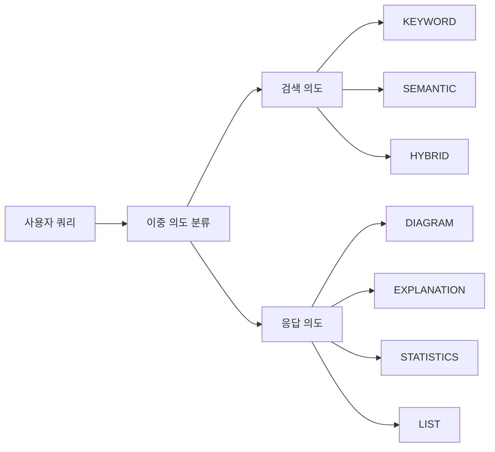
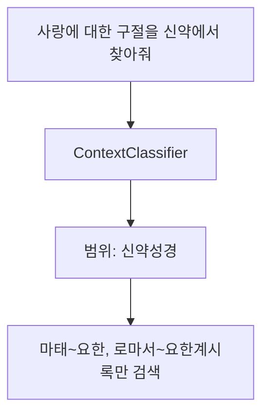
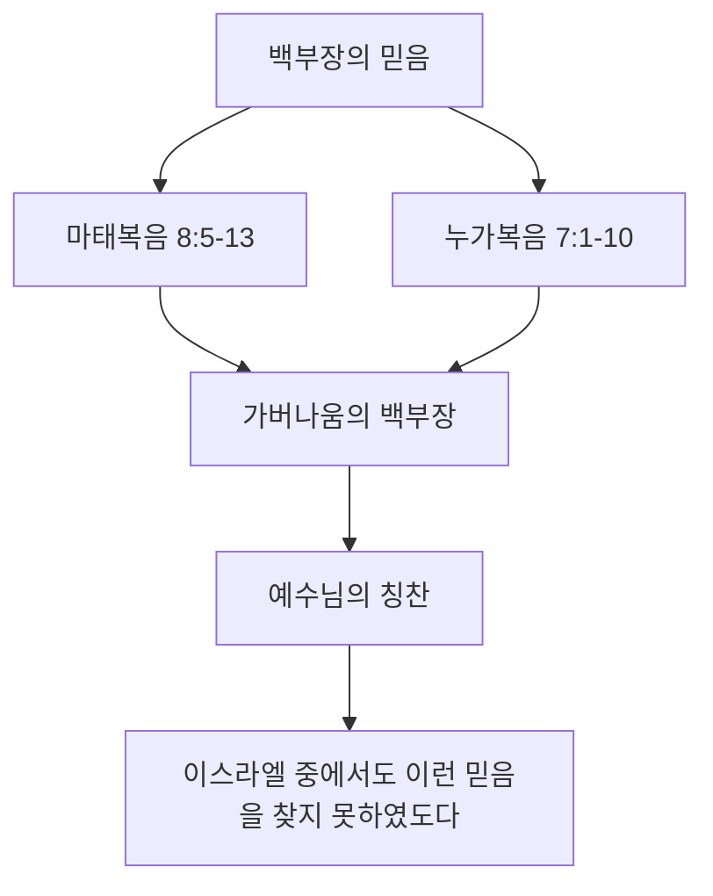
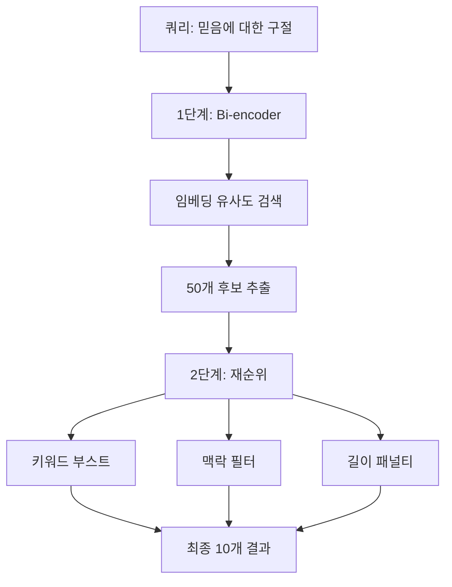

# Bible AI 사용 예시 - Gemini보다 나은 점

## 🎯 핵심 차이점

**그냥 Gemini에게 물어보기:**
- 일반적인 지식에 기반한 답변
- 정확한 구절 참조가 어려움
- 실제 성경 본문을 직접 접근할 수 없음
- 통계나 분석이 불가능

**Bible AI Agent:**
- ✅ 실제 성경 데이터베이스 접근 (66권, ~62,000절 - 한국어+영어)
- ✅ Smart RAG: 이중 의도 분류로 최적의 검색
- ✅ 정확한 구절 참조 및 검증
- ✅ 전체 성경 통계 분석
- ✅ 주변 구절 컨텍스트 제공
- ✅ 구조화된 검색 및 분석
- ✅ 맥락 인식 검색 (구약/신약, 복음서/서신서 등)
- ✅ 클릭 가능한 구절 링크와 미리보기

---

## 🚀 Smart RAG 시스템 (신규!)

### 이중 의도 분류

Bible AI는 두 가지 의도를 동시에 분석합니다:



**1. 검색 의도 (Search Intent)**

| 쿼리 예시 | 검색 의도 | 설명 |
|-----------|----------|------|
| "백부장이 나온 구절 찾아줘" | KEYWORD | 정확한 단어 매칭 |
| "사랑의 의미를 알려줘" | SEMANTIC | 의미 기반 검색 |
| "믿음에 대한 바울의 가르침" | HYBRID | 키워드 + 의미 결합 |

**2. 응답 의도 (Response Intent)**

| 쿼리 예시 | 응답 의도 | LLM 필요 |
|-----------|----------|----------|
| "백부장이 나온 구절을 그림으로 설명해줘" | DIAGRAM | ✅ |
| "사랑에 대해 자세히 설명해줘" | EXPLANATION | ✅ |
| "믿음이 몇 번 나와?" | STATISTICS | ❌ 직접 응답 |
| "사랑에 대한 구절 찾아줘" | LIST | ❌ 직접 응답 |

### 맥락 인식 검색



| 쿼리 | 감지된 범위 | 검색 대상 |
|------|------------|----------|
| "신약에서 사랑 구절" | 신약성경 | 마태복음 ~ 요한계시록 |
| "복음서에서 백부장" | 복음서 | 마태, 마가, 누가, 요한복음 |
| "구약 선지서에서 메시아" | 선지서 | 이사야 ~ 말라기 |

---

## 📖 실제 사용 예시

### 1. **다이어그램과 함께 설명 (신규!)**

**질문:** "백부장이 나온 구절을 그림과 함께 설명해줘"

**Gemini:**
- 텍스트로만 설명
- 시각화 불가능

**Bible AI:**
- ✅ ResponseIntentClassifier가 DIAGRAM 의도 감지
- ✅ SmartBibleSearchService가 "백부장" 관련 구절 사전 검색
- ✅ LLM이 Mermaid 다이어그램 생성

**예시 응답:**



> **마태복음 8:10** 예수께서 들으시고 놀랍게 여기사 따르는 자들에게 이르시되 
> 내가 진실로 너희에게 이르노니 이스라엘 중 아무에게서도 이만한 믿음을 만나 보지 못하였노라

---

### 2. **정확한 구절 조회**

**질문:** "창세기 1장 1절이 뭐야?"

**Gemini:**
- 일반적인 지식으로 답변
- 정확한 번역 확인 불가

**Bible AI:**
```
✅ 실제 성경 데이터에서 정확히 조회
✅ 개역개정 번역본의 정확한 본문 제공
✅ 구절 참조: "창세기 1:1 <천지 창조> 태초에 하나님이 천지를 창조하시니라"
✅ 클릭하면 주변 구절과 함께 미리보기 패널에 표시
```

---

### 3. **맥락 인식 검색 (신규!)**

**질문:** "사랑에 대한 구절을 신약 서신서에서 찾아줘"

**Gemini:**
- 범위 제한 검색 불가
- 구약/신약 구분 없이 혼합된 결과

**Bible AI:**
```
✅ ContextClassifier가 "신약 서신서" 범위 감지
✅ 로마서, 고린도전후서, 갈라디아서 등만 검색
✅ IntentClassifier가 HYBRID 검색 방식 선택

검색 결과:
- 검색 범위: 신약 서신서
- 검색 방법: HYBRID
- 결과: 15건

고린도전서 13:4 사랑은 오래 참고 사랑은 온유하며...
로마서 8:35 누가 우리를 그리스도의 사랑에서 끊으리요...
```

---

### 4. **통계 분석** (LLM 없이 직접 응답!)

**질문:** "사랑이라는 단어가 성경에 몇 번 나와?"

**Gemini:**
- 추정치나 일반적인 답변만 가능
- 정확한 숫자 제공 불가

**Bible AI:**
```
✅ ResponseIntentClassifier가 STATISTICS 의도 감지
✅ LLM 없이 직접 통계 계산 (더 빠르고 정확!)
✅ getKeywordStatistics("사랑") 도구 사용

예시 응답:
**검색 결과 통계**

- 검색어: 사랑
- 검색 방법: HYBRID
- 검색 결과: 245건
- 검색 시간: 23ms

Occurrences by book:
  - 요한일서: 28 times
  - 고린도전서: 18 times
  - 로마서: 15 times
  ...
```

---

### 5. **인터랙티브 구절 미리보기 (신규!)**

응답에 포함된 구절 참조(예: 요한복음 3:16)를 클릭하면:

```
✅ 해당 구절이 오른쪽 미리보기 패널에 표시
✅ 앞뒤 2절씩 맥락과 함께 표시
✅ "📖 전체 장 읽기" 버튼으로 전체 장 읽기 뷰로 이동
```

---

### 6. **주변 구절 컨텍스트**

**질문:** "요한복음 3:16 주변 구절도 보여줘"

**Gemini:**
- 해당 구절만 제공
- 주변 맥락 파악 어려움

**Bible AI:**
```
✅ getVerseWithContext("요한복음", 3, 16, 3) 도구 사용
✅ 앞뒤 3절씩 포함하여 전체 맥락 제공

예시 응답:
요한복음 3:13 하늘에서 내려온 자 곧 인자 외에는 하늘에 올라간 자가 없느니라
요한복음 3:14 모세가 광야에서 뱀을 든 것 같이 인자도 들려야 하리니
요한복음 3:15 이는 그를 믿는 자마다 영생을 얻게 하려 함이니라
요한복음 3:16 <하나님의 사랑> 하나님은 세상을 이처럼 사랑하사 독생자를 주셨으니...
요한복음 3:17 하나님이 그 아들을 세상에 보내신 것은 세상을 심판하려 하심이 아니요...
요한복음 3:18 그를 믿는 자는 심판을 받지 아니하는 것이요...
```

---

### 7. **2단계 검색 (Two-Stage Retrieval)**

**질문:** "믿음에 대한 모든 구절 찾아줘"

**처리 과정:**



| 단계 | 처리 | 결과 |
|------|------|------|
| 1단계 | Bi-encoder 임베딩 유사도 | 50개 후보 |
| 2단계 | 재순위 + 필터링 | 10개 최종 결과 |

---

### 8. **복합 질문 (대화 맥락 유지)**

**대화 예시:**

```
사용자: "사랑에 대한 구절 찾아줘"
AI: [여러 구절 제공 - 구절 참조가 클릭 가능]

사용자: "첫 번째 구절 주변도 보여줘"
AI: [이전 대화 맥락을 기억하고 첫 번째 구절의 주변 구절 제공]

사용자: "이 구절이 몇 번 나와?"
AI: [통계 분석 제공 - LLM 없이 직접 응답]

사용자: "이걸 그림으로 설명해줘"
AI: [Mermaid 다이어그램으로 시각화]
```

---

## 📊 성능 비교

| 기능 | Gemini 직접 질문 | Bible AI Agent |
|------|-----------------|----------------|
| 정확한 구절 조회 | ❌ 추정 | ✅ 실제 데이터 |
| 통계 분석 | ❌ 불가능 | ✅ 정확한 통계 (LLM 없이) |
| 주변 구절 | ❌ 어려움 | ✅ 자동 제공 |
| 전체 성경 검색 | ❌ 제한적 | ✅ 전체 검색 |
| 범위 지정 검색 | ❌ 불가능 | ✅ 구약/신약/복음서/서신서 |
| 대화 맥락 유지 | ⚠️ 제한적 | ✅ 세션 기반 |
| 다이어그램 생성 | ⚠️ 요청 시 | ✅ 자동 감지 |
| 구절 범위 조회 | ❌ 어려움 | ✅ 한 번에 |
| 정확한 검증 | ❌ 추정 | ✅ 정확 |
| 인터랙티브 UI | ❌ 없음 | ✅ 클릭 가능한 구절 |
| 검색 속도 | - | ✅ ~20-50ms |

---

## 🔧 응답 유형별 처리

| 응답 유형 | 키워드 예시 | LLM 필요 | 처리 방식 |
|-----------|------------|---------|----------|
| DIAGRAM | 그림, 다이어그램, 도표 | ✅ | Mermaid 다이어그램 생성 |
| EXPLANATION | 설명해줘, 알려줘, 가르쳐줘 | ✅ | 상세 설명 |
| CONTEXT | 주변 구절, 맥락, 앞뒤 | ✅ | 맥락과 함께 설명 |
| STATISTICS | 몇 번, 몇 개, 통계 | ❌ | 직접 통계 계산 |
| LIST | 찾아줘, 보여줘, 나열해줘 | ❌ | 구절 목록 반환 |

---

## 💡 결론

Bible AI Agent는 단순히 Gemini에게 물어보는 것보다:

1. **Smart RAG**: 이중 의도 분류로 최적의 검색 및 응답
2. **정확성**: 실제 성경 데이터베이스 접근 (~62,000절)
3. **맥락 인식**: 자동으로 구약/신약/책 유형 범위 제한
4. **효율성**: 통계/목록은 LLM 없이 직접 응답 (더 빠름)
5. **시각화**: 자동으로 다이어그램 의도 감지 및 생성
6. **인터랙티브**: 클릭 가능한 구절 링크와 미리보기 패널
7. **대화**: 세션 기반 연속 대화 지원

이러한 기능들로 **실제 성경 연구와 학습에 유용한 도구**가 됩니다.

---

## 🎯 권장 질문 형식

더 나은 결과를 위해:

```
# 다이어그램 원할 때
"~를 그림으로 설명해줘"
"~를 다이어그램으로 보여줘"
"~를 시각적으로 정리해줘"

# 범위 지정 검색
"~를 신약에서 찾아줘"
"~가 복음서에서 어디에 나와?"
"구약 선지서에서 ~"

# 통계 원할 때
"~가 몇 번 나와?"
"~의 출현 빈도"
"~ 통계"

# 맥락과 함께
"~ 주변 구절도"
"~의 맥락을 알려줘"
```
